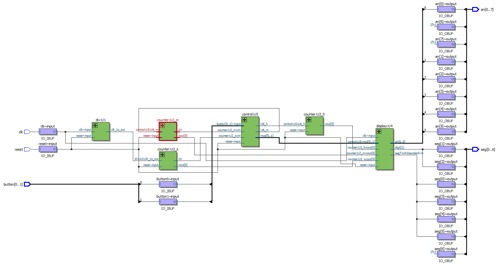

# DigitalClock
课程设计_数字钟项目

## [Source](./Source)
 - DigitalClock_top. =>  顶层文件
 - div.v  => 分频模块，将50MHz转换为1MHz
 - counter.v  =>  带参数的加计数器，对时、分、秒分别计数
 - binbcd8.v  =>  将二进制码转换为8421BCD码
 - control.v  =>  校时、校分、设置闹钟
 - seg7.v  =>  共阳极七段数码管译码
 - display.v  =>  动态扫描显示

## 项目介绍
1. 具备基础的校时、校分、计时功能；
2. 没有实现闹钟功能，不过可以扩展；
3. 其中div.v，binbcd8.v，seg7.v，display.v参考自教科书上的案例，其他均为自己编写；

## 数字钟原理

    输入端共有4个，分别是reset、clk、button0、button1。其中reset对数字钟进行同步清零，上升沿触发，相当于数字钟的初始化。clk是晶振的输入端，常用频率为50MHz的晶振作为时钟源。button0是一个可产生上升沿的按钮，作为模式选择的功能键，可使数字钟在计时、校分、校时、设置闹钟四个模式进行切换。button1也是一个可产生上升沿的按钮，作为时间调节按钮，可对小时和分钟进行加计数。

    输出端共有2个，分别是seg和an。其中seg是一个位宽为7的总线向量，用来给数码管传输段选数据，控制数码管显示不同的数字。an是一个位宽为8的总线向量，用来给数码管传输位选数据，控制要点亮哪个数码管，本项目中使用了6个数码管显示来显示，时、分、秒各2个。

    div:U1模块，相当于一个分频器，将晶振的高频信号变为低频信号，输出1Hz（周期为1s）信号，用于驱动秒计数器。

    counter:U2模块，是加计数模块，用于模拟时（24）、分（60）、秒（60）的正常走时。秒、分、时采用串联结构，前一级的输出作为后一级的输入，用于驱动后一级计数。

    binbcd8:U3模块，可将二进制码转换为8421BCD码，例如：8'b0001_1001->8'b0010_0101。

    display:U4模块，是显示模块，将输入的时、分、秒的BCD码译码后显示在7段数码管上，时、分、秒的十位和个位可以分别显示。

    control:U5模块，是控制模块，用来选择正常计时、校时、校分、设置闹钟。并控制时和分的加计数。

 - RTL图:

 - 门电路图:

